# Comandos básicos do Docker

## **Estrutura básica**

## docker \<objeto> \<comando> \<opções>

**Objetos mais usados**

- image
- container
- volume
- network
- system

### 1.1 docker image pull \<imagem>
Baixa uma imagem em um repósitorio de imagens do Docker

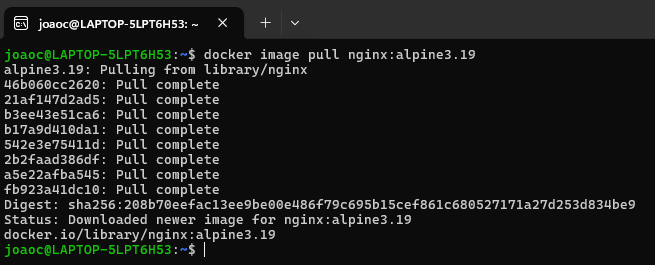

## OBS:
    - Imagem: nginx
    - Tag: alpine3.19

### 1.2 docker image ls
Lista as imagens contidas no Docker

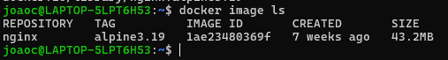

### 1.3 docker image ls -q
Lista apenas o ID das imagens contidas no Docker

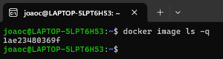

### 1.4 docker image inspect
Traz informações específicas sobre uma imagem

```
docker image inspect nginx:alpine3.19
```

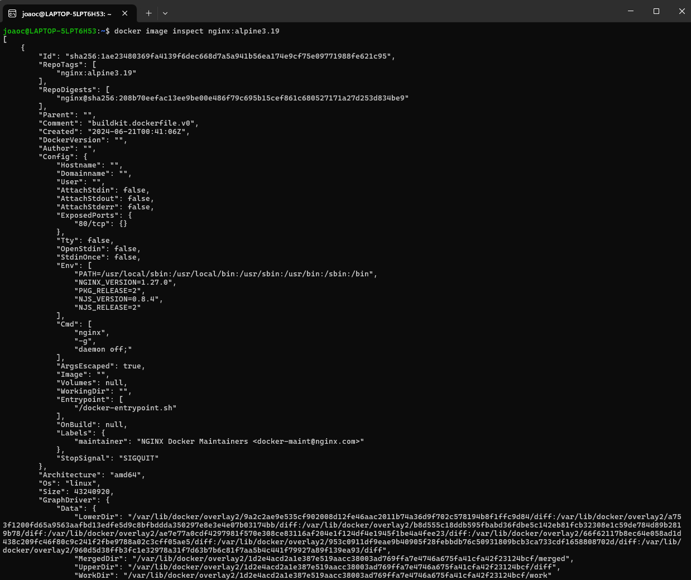

### 1.5 docker image save
Salva uma imagem em um arquivo compactado

OBS: importante realizar o comando no terminal com o local de destino previamente definido:

```
cd OneDrive/Documentos/Studies/Docker
```

```
docker image save nginx.alpine3.19 -o alpine.tar
```

* **-o**: output (nome que será dado ao arquivo compactado que armazenará a imagem)

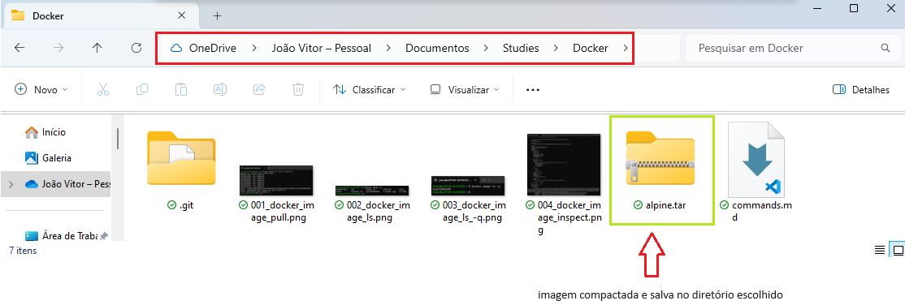

### 1.6 docker image rm
Remove uma imagem do host

Pode se usar o nome da imagem e sua tag:
```
docker image rm nginx:alpine3.19
```

Ou o ID da imagem:
```
docker image rm 1ae23480369f
```

### 1.7 docker image load
Descompacta uma imagem compactada em arquivo e carrega no host

```
docker image load -i alpine.tar
```

* **-i**: input (nome do arquivo a ser descompactado)

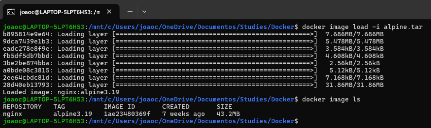

### 2.1 docker container run
Cria um container baseado em uma imagem do host

```
docker container run nginx:3.19
```

#### Parâmetros importantes

- -d (dettached mode): vai rodar o container sem prender o usuário no terminal
- -i (interactive mode): modo interativo
- -t (terminal): cria um terminal organizado
- --name (nome): concede um nome ao container

```
docker container run -it --entrypoint /bin/sh nginx:3.19
```

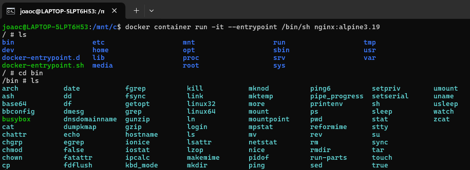

```
docker container run -d --name "alpine" nginx:alpine:3.19
```


### 2.2 docker container create
Cria um container sem executá-lo automaticamente

```
docker container create --name nginx-2 nginx:alpine3.19
```

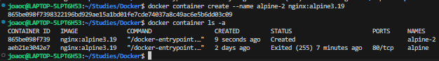

### 2.3 docker container start
Inicializa o container criado

```
docker container start <nome-do-container> OU <id-do-container>
```

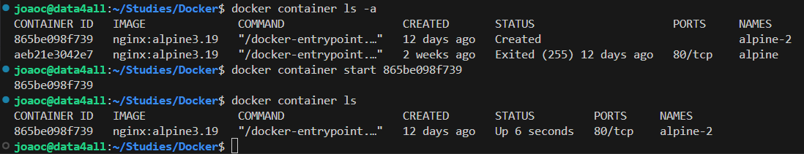

### 2.4 docker container stop
Parada sutil, graciosa, do container. Verifica se há algum processo rodando e aguarda a sua finalização

```
docker container stop <nome-do-container> OU <id-do-container>
```

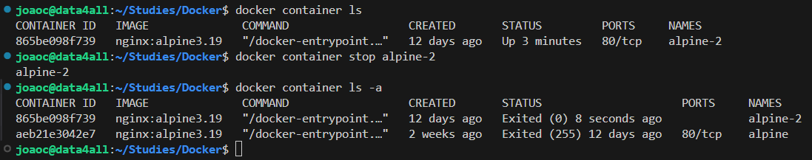

### 2.5 docker container kill
Parada imediata do container

```
docker container kill <nome-do-container> OU <id-do-container>
```

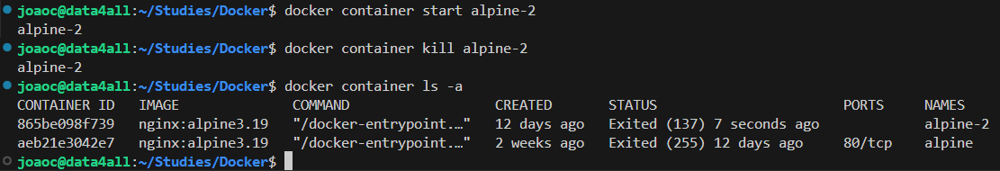

### 2.6 docker container pause
Congela o container, mas não o paraliza totalmente

```
docker container pause <nome-do-container>
```

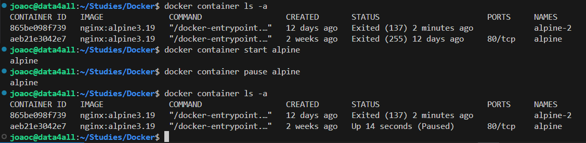

### 2.7 docker container unpause
Descongela o container

```
docker container unpause <nome-do-container>
```

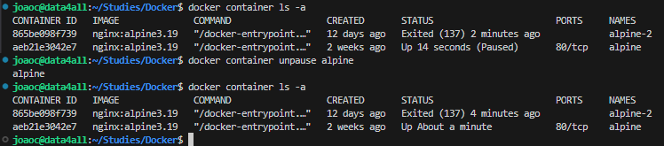

### 2.8 docker container rm
Remove o container do host

```
docker container rm <nome-do-container>
```

**OBS**: Para remover um container que está em execução:
```
docker container rm <nome-do-container> --force
```

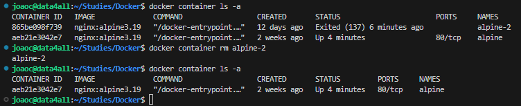

### 2.9 docker container restart
Reinicia o container (bom para executar atualizações ou dar reboot no container)

```
docker container restart
```

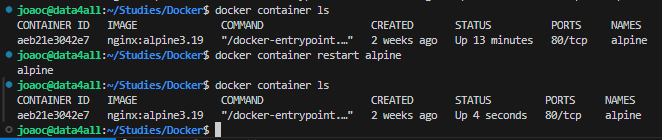

### 2.10 docker container rename
Renomeia um container existente

```
docker container rename <nome-atual-do-container> <nome-novo-do-container>
```

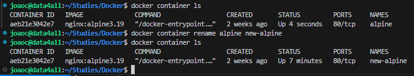

### Associando porta do host à uma porta do container

```
docker container run -dt --name nginx -p 8080:80 nginx:1.23.1
```

* -d: dettached mode
* -t: cria um terminal
* -p: estabelece a porta do host (8080) e a porta selecionada de entrada do container (80)

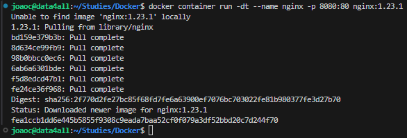

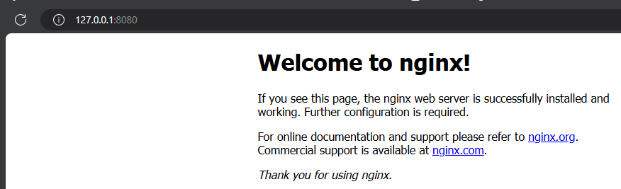

```
docker container run -dt --name mysql --entrypoint /bin/sh -P mysql:8.0.30
```

* --entrypoint: __a preencher__
* -P: estabelece portas aleatórias no lado do host

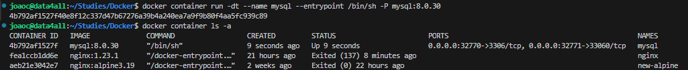

### 2.11 docker container inspect
Retorna um JSON com todas as informações relacionadas ao container

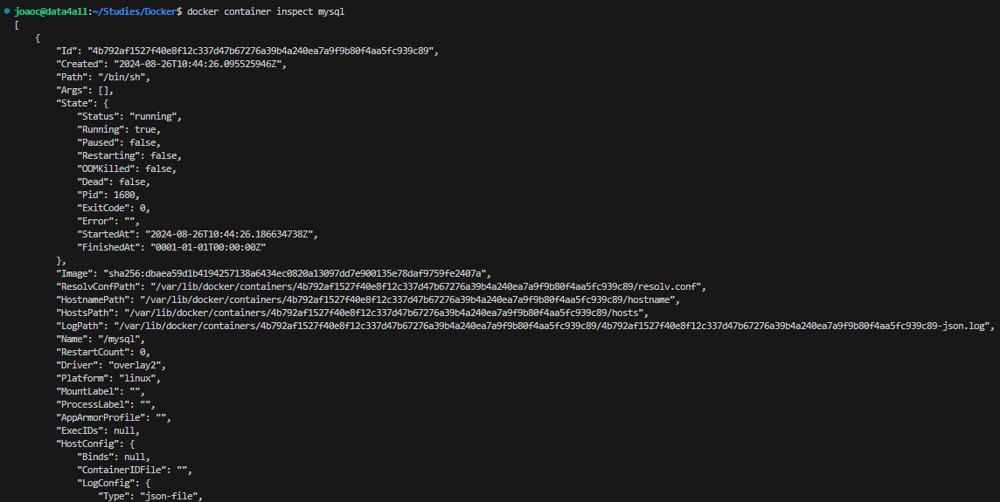

### 2.12 docker container port
Retorna todas as portas associadas ao container

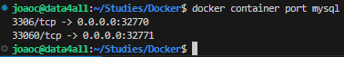

### 2.13 docker container diff
Indica todas as alterações executadas desde a primeira execução do container

- Criei o arquivo arquivo-teste.txt no container
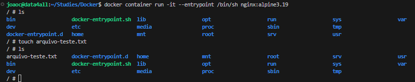

- Vou verificar as diferenças em um outro terminal com o comando diff
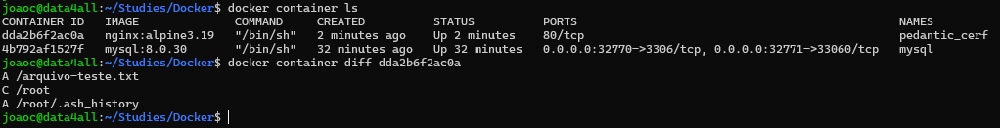

### 2.14 docker container logs
Retorna os logs do container

* -f: prende o terminal e retorna em tempo real todos os processos realizados no container