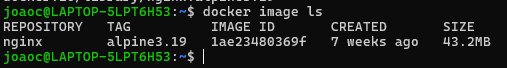
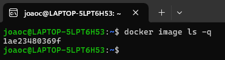
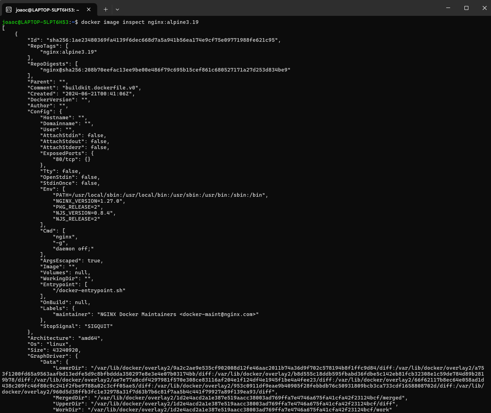
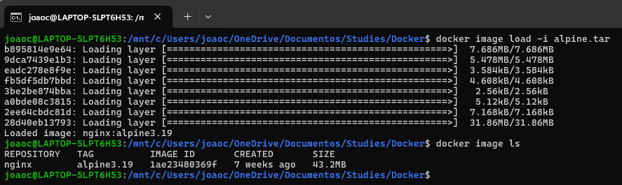
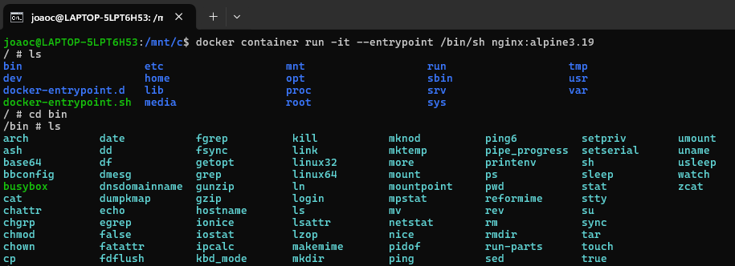
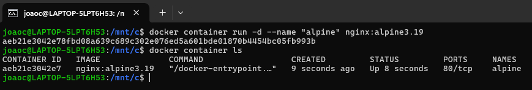

# Comandos básicos do Docker

## **Estrutura básica**

## docker \<objeto> \<comando> \<opções>

**Objetos mais usados**

- image
- container
- volume
- network
- system

### 1.1 docker image pull \<imagem>
Baixa uma imagem em um repósitorio de imagens do Docker


## OBS:
    - Imagem: nginx
    - Tag: alpine3.19

### 1.2 docker image ls
Lista as imagens contidas no Docker



### 1.3 docker image ls -q
Lista apenas o ID das imagens contidas no Docker



### 1.4 docker image inspect
Traz informações específicas sobre uma imagem

```
docker image inspect nginx:alpine3.19
```



### 1.5 docker image save
Salva uma imagem em um arquivo compactado

OBS: importante realizar o comando no terminal com o local de destino previamente definido:

```
cd OneDrive/Documentos/Studies/Docker
```

```
docker image save nginx.alpine3.19 -o alpine.tar
```

* **-o**: output (nome que será dado ao arquivo compactado que armazenará a imagem)


### 1.6 docker image rm
Remove uma imagem do host

Pode se usar o nome da imagem e sua tag:
```
docker image rm nginx:alpine3.19
```

Ou o ID da imagem:
```
docker image rm 1ae23480369f
```

### 1.7 docker image load
Descompacta uma imagem compactada em arquivo e carrega no host

```
docker image load -i alpine.tar
```

* **-i**: input (nome do arquivo a ser descompactado)



### 2.1 docker container run
Cria um container baseado em uma imagem do host

```
docker container run nginx:3.19
```

#### Parâmetros importantes

- -d (dettached mode): vai rodar o container sem prender o usuário no terminal
- -i (interactive mode): modo interativo
- -t (terminal): cria um terminal organizado
- --name (nome): concede um nome ao container

```
docker container run -it --entrypoint /bin/sh nginx:3.19
```



```
docker container run -d --name "alpine" nginx:alpine:3.19
```



